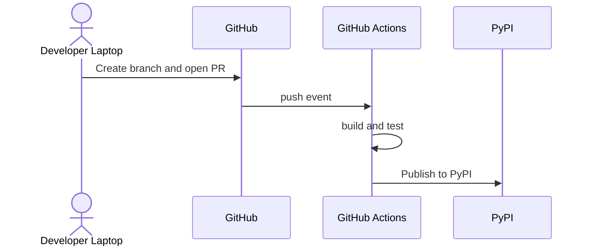
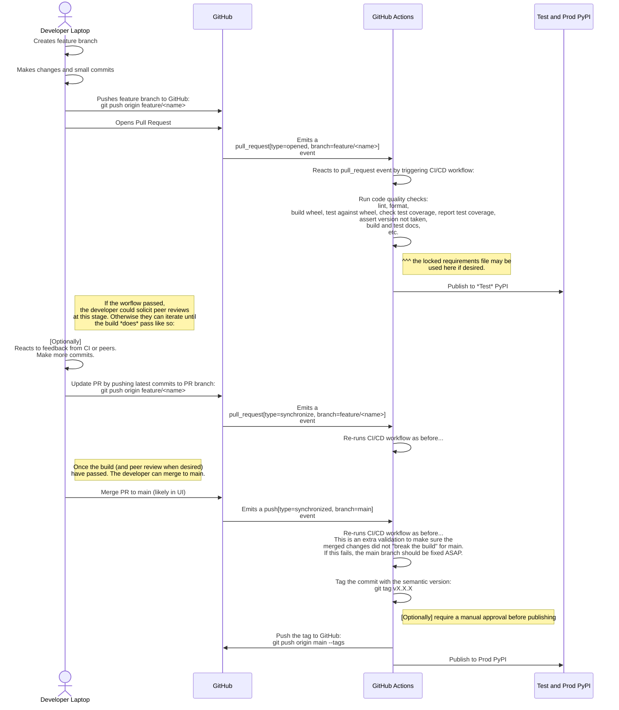

The flow of a PR with a Mermaid sequence diagram.

Entities:
- The user
- GitHub
- GitHub Actions
- Test and Prod PyPI
- PyPI

The user will interact with GitHub with the CLI.
GitHub will interact with GitHub Actions by emitting events.
GitHub Actions will execute jobs and steps after being triggered by those events.

## High-level CI/CD Workflow

## Detailed CI/CD Workflow for Python Packages

